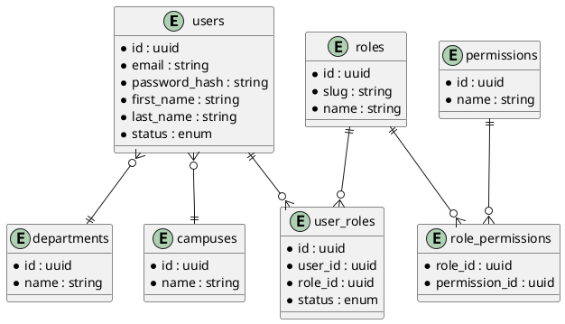

# AI-Powered University ERP & Academic Intelligence Platform

## Project Overview

**Project Name:** AI-Powered University ERP & Academic Intelligence Platform

**Client:** Refine International University

**Objective:** Design and deliver a scalable university ERP system that supports every stage of the student lifecycle, faculty and academic operations, examinations, finance, analytics, and AI-driven intelligence for multiple campuses with support for 50,000+ students.

**Target Portals:**
- Student Portal
- Faculty Portal
- Department Portal
- Administrative Portal
- Examination Office Portal
- Finance Office Portal
- Executive Management Portal
- Parent/Guardian Portal

---

## 1. Business Requirements

### Primary Objectives
- Centralize student lifecycle management from admissions through alumni.
- Enable secure, role-based access for all university stakeholders.
- Provide AI-powered decision support and analytics.
- Automate scheduling, timetabling, and conflict resolution.
- Simplify finance, examination, and attendance operations.
- Offer scalable multi-campus administration.
- Ensure compliance, security, and auditability.

### Stakeholder Goals
- Super Admin: Manage global system settings, campus configuration, security, and global reports.
- Vice Chancellor: Executive analytics and university performance oversight.
- Registrar: Manage admissions, student records, registration, and compliance.
- Dean / Director Academics / HOD: Manage academic planning, curriculum, and faculty allocation.
- Program Coordinator: Operate program workflows, course assignments, and academic scheduling.
- Faculty Member: Manage teaching schedules, course material, attendance, and assessments.
- Admission Officer: Manage leads, applications, interviews, and enrollment offers.
- Examination Officer: Manage exam schedules, seating, invigilation, and result processing.
- Finance Officer: Manage fee structures, billing, payments, and financial reporting.
- Student Affairs Officer: Manage student services, certificates, complaints, and discipline actions.
- HR Officer: Manage employee records, attendance, leaves, and evaluations.
- Student / Alumni / Parent/Guardian: View personalized academic, attendance, financial, and notification data.

### Core Business Needs
- Role-based user and permission management.
- Campus, faculty, school, and department organization.
- Complete admission pipeline with automated offers and fee vouchers.
- End-to-end student information and registration system.
- Curriculum-driven academic planning and timetable generation.
- Robust attendance and makeup class management.
- Comprehensive examination and result management.
- Financial management and scholarship handling.
- Alumni engagement, event management, and donor tracking.
- Executive dashboards and BI analytics.
- AI models for risk prediction, forecasting, and optimization.

---

## 2. Functional Requirements (FRS)

### Module 1: User & Access Management
- Login and secure authentication.
- Multi-factor authentication (MFA) for high-risk roles.
- Password reset and account recovery.
- User profile creation and management.
- Role management and permission control.
- Department and campus assignment.
- Session management and token revocation.
- Audit logging for all user actions.

### Module 2: University Structure Management
- Campus, faculty, school, and department creation.
- Program and specialization management.
- Academic year, semester, batch, and section management.
- Course and curriculum version management.
- Organizational hierarchy and mapping.

### Module 3: Admission Management
- Prospect and lead management.
- Admission campaign and marketing tracking.
- Online application submission.
- Document upload and verification.
- Entry test and interview scheduling.
- Merit list and admission approvals.
- Fee voucher and offer letter generation.
- Student onboarding workflow.

### Module 4: Student Information System
- Student profile and guardian details.
- Academic registration and roll number issuance.
- Semester and course registration.
- Degree progress and academic history tracking.
- Enrollment reporting and student status management.

### Module 5: Academic Management
- Course offering and curriculum mapping.
- CLO / PLO management.
- Semester planning and academic calendar.
- Section creation and faculty allocation.
- Course performance tracking.

### Module 6: AI-Powered Timetable Generator
- Input faculty availability, courses, sections, rooms, labs, and credit hours.
- Enforce hard constraints: faculty clash, room clash, student clash, lab use, capacity.
- Support soft constraints: preferences, consecutive scheduling, room preferences.
- Produce student, faculty, department timetables, and room utilization reports.
- Enable auto-rescheduling and optimization.

### Module 7: Faculty Management
- Faculty profiles, qualifications, experience, publications, and certifications.
- Research project tracking.
- Teaching assignments and workload management.
- Faculty analytics and utilization reports.

### Module 8: Attendance Management
- Student attendance capture.
- Faculty attendance capture.
- QR, mobile, and biometric integration.
- Analytics, defaulter tracking, and attendance reporting.

### Module 9: Makeup Class Management
- Faculty makeup class requests.
- HOD approval workflow.
- Room availability and clash detection.
- Schedule creation and student notifications.
- Attendance synchronization for makeup classes.

### Module 10: Learning Management System
- Course content management.
- Lecture notes, videos, assignments, quizzes.
- Discussion forums and online classes.
- Gradebook and learning analytics.

### Module 11: Examination Management
- Date sheet and seating plan generation.
- Invigilation and room allocation.
- Exam attendance tracking.
- Unfair means cases and extra sheet tracking.
- Marks entry and result processing.

### Module 12: Finance Management
- Fee structures and challans.
- Scholarships, financial aid, installments.
- Fine management and defaulter tracking.
- Refund processing.
- Financial analytics and revenue reporting.

### Module 13: Student Affairs Portal
- Complaint and service request management.
- Leave application tracking.
- Certificate and transcript request workflows.
- Counseling and discipline case management.

### Module 14: Document Management
- Policy, SOP, circular, and archive repository.
- Document approval workflows.
- Digital archive retrieval.

### Module 15: Room & Resource Management
- Room inventory management.
- Lab and resource scheduling.
- Resource booking and maintenance requests.
- Utilization reporting.

### Module 16: HR Management
- Employee records and leave management.
- Attendance and performance evaluation.
- Training and employee analytics.

### Module 17: Graduation Management
- Degree audit and eligibility checks.
- Clearance workflows.
- Convocation management.
- Degree issuance and reporting.

### Module 18: Alumni Management
- Alumni profiles and networking.
- Employment tracking.
- Alumni events and donations.
- Engagement analytics.

### Module 19: Executive Dashboards
- Role-based executive dashboards.
- KPIs for enrollment, revenue, attendance, faculty, graduation.
- Real-time analytics tiles.

### Module 20: Business Intelligence & Analytics
- Data warehouse and ETL architecture.
- Star schema and data mart design.
- Student, faculty, financial, operational analytics.

### Module 21: AI Intelligence Layer
- AI chatbot for user support.
- Student risk and dropout prediction.
- CGPA and enrollment forecasting.
- Revenue and faculty performance prediction.
- Resource utilization and timetable optimization.

---

## 3. System Architecture

### Recommended Architecture
- Frontend: Next.js App Router with React and Tailwind CSS.
- Backend: Node.js with NestJS for modular microservice-ready APIs.
- Database: PostgreSQL.
- ORM: Prisma.
- Authentication: JWT + OAuth + MFA.
- Storage: AWS S3 or Azure Blob.
- Analytics: Power BI / Metabase.
- AI: OpenAI API, Python services, TensorFlow / scikit-learn.
- Infrastructure: Docker + Kubernetes.

### Architectural Layers
- **Presentation Layer:** Web UI, mobile apps, dashboards.
- **API Layer:** REST/GraphQL services and authentication.
- **Business Logic Layer:** HR, admissions, academic, finance, AI modules.
- **Data Layer:** PostgreSQL OLTP and analytics warehouse.
- **Integration Layer:** Notifications, document storage, payment gateways.

### Deployment Architecture
- Containerized services deployed in Kubernetes.
- Separate environments: dev, test, staging, prod.
- Database cluster with primary and read replicas.
- Load balancers for API and UI.
- CI/CD pipeline for build, test, and deployment.

---

## 4. Database Design

### Core Entities
- `users`
- `roles`
- `permissions`
- `user_roles`
- `campuses`
- `faculties`
- `schools`
- `departments`
- `programs`
- `specializations`
- `batches`
- `sections`
- `academic_years`
- `semesters`
- `courses`
- `curriculums`
- `students`
- `guardians`
- `applications`
- `enrollments`
- `timetable_slots`
- `rooms`
- `labs`
- `attendance_records`
- `exams`
- `results`
- `fee_invoices`
- `payments`
- `complaints`
- `documents`
- `audit_logs`
- `notifications`

### Sample Tables

#### `users`
- `id` UUID PK
- `email` TEXT UNIQUE NOT NULL
- `password_hash` TEXT
- `first_name` TEXT
- `last_name` TEXT
- `phone` TEXT
- `status` ENUM(`PENDING`, `ACTIVE`, `SUSPENDED`, `DEACTIVATED`)
- `department_id` UUID
- `campus_id` UUID
- `is_email_verified` BOOLEAN
- `last_login_at` TIMESTAMP
- `created_at` TIMESTAMP
- `updated_at` TIMESTAMP

#### `roles`
- `id` UUID PK
- `slug` TEXT UNIQUE
- `name` TEXT
- `description` TEXT
- `level` INT
- `created_at` TIMESTAMP
- `updated_at` TIMESTAMP

#### `permissions`
- `id` UUID PK
- `name` TEXT UNIQUE
- `description` TEXT
- `created_at` TIMESTAMP
- `updated_at` TIMESTAMP

#### `user_roles`
- `id` UUID PK
- `user_id` UUID
- `role_id` UUID
- `assigned_by` UUID
- `approved_by` UUID
- `status` ENUM(`REQUESTED`, `APPROVED`, `REJECTED`, `REVOKED`)
- `requested_at` TIMESTAMP
- `approved_at` TIMESTAMP
- `effective_from` DATE
- `effective_to` DATE

#### `approval_requests`
- `id` UUID PK
- `user_role_id` UUID
- `requested_by` UUID
- `approver_id` UUID
- `role_id` UUID
- `status` ENUM(`PENDING`, `APPROVED`, `REJECTED`, `ESCALATED`)
- `request_type` ENUM(`ROLE_ASSIGNMENT`, `ROLE_CHANGE`, `DEACTIVATION`)
- `reason` TEXT
- `comments` TEXT
- `created_at` TIMESTAMP
- `updated_at` TIMESTAMP

#### `audit_logs`
- `id` UUID PK
- `actor_id` UUID
- `target_user_id` UUID
- `action` TEXT
- `entity` TEXT
- `entity_id` UUID
- `details` JSONB
- `ip_address` TEXT
- `user_agent` TEXT
- `created_at` TIMESTAMP

---

## 5. Entity Relationship Diagram (ERD)

### Key Relationships
- `users` ↔ `user_roles` ↔ `roles`
- `roles` ↔ `permissions`
- `departments` ↔ `programs` ↔ `courses`
- `campuses` ↔ `faculties` ↔ `departments`
- `students` ↔ `enrollments` ↔ `courses`
- `courses` ↔ `timetable_slots` ↔ `rooms`
- `admissions` ↔ `applications` ↔ `students`
- `attendance_records` ↔ `students`, `sections`, `courses`
- `exams` ↔ `courses`, `rooms`, `students`

### ERD PlantUML Example

---

## 6. API Documentation

### Authentication APIs
- `POST /api/auth/login`
- `POST /api/auth/refresh`
- `POST /api/auth/logout`
- `POST /api/auth/register`
- `POST /api/auth/mfa/verify`
- `POST /api/auth/password/forgot`
- `POST /api/auth/password/reset`

### User Management APIs
- `GET /api/users`
- `GET /api/users/:id`
- `POST /api/users`
- `PUT /api/users/:id`
- `PATCH /api/users/:id/status`
- `DELETE /api/users/:id`

### Role & Permission APIs
- `GET /api/roles`
- `GET /api/roles/:id`
- `POST /api/roles`
- `PUT /api/roles/:id`
- `DELETE /api/roles/:id`
- `PUT /api/roles/:id/permissions`
- `GET /api/permissions`
- `POST /api/permissions`

### University Structure APIs
- `GET /api/campuses`
- `POST /api/campuses`
- `GET /api/faculties`
- `POST /api/faculties`
- `GET /api/departments`
- `POST /api/departments`
- `GET /api/programs`
- `POST /api/programs`
- `GET /api/courses`
- `POST /api/courses`

### Admission APIs
- `GET /api/applications`
- `POST /api/applications`
- `POST /api/admissions`
- `GET /api/admission-reports`

### SIS APIs
- `GET /api/students/:id`
- `POST /api/students`
- `GET /api/enrollments`
- `POST /api/enrollments`

### Timetable APIs
- `POST /api/timetable/generate`
- `GET /api/timetable/student/:studentId`
- `GET /api/timetable/faculty/:facultyId`
- `GET /api/timetable/room/:roomId`

### Attendance APIs
- `POST /api/attendance`
- `GET /api/attendance/reports`

### Examination APIs
- `POST /api/exams`
- `GET /api/exam-schedule`
- `POST /api/results`
- `GET /api/result-reports`

### Finance APIs
- `POST /api/fees`
- `GET /api/fee-invoices`
- `POST /api/payments`
- `GET /api/finance-reports`

### Notifications APIs
- `POST /api/notifications/send`
- `GET /api/notifications`
- `PATCH /api/notifications/:id/read`

### Audit APIs
- `GET /api/audit-logs`
- `GET /api/audit-logs/:id`

---

## 7. UI Screen Summary

### Common Navigation
- Side menu with modules: Dashboard, Users, Admissions, Academic, Timetable, Exams, Finance, Attendance, Reports, Settings.
- Top header with notifications, user profile, and quick actions.

### Dashboard
- KPI tiles for enrollment, revenue, attendance, faculty workload, timetable health.
- Trend charts and executive scorecards.
- Pending approvals and action cards.

### User Management
- User list with filters by role, status, department, campus.
- Add/edit user dialogs.
- Role assignment workflow.

### Role & Access Management
- Role list and permission matrix.
- Permission editor.
- Approval queue for access requests.

### Admission Portal
- Lead funnel and application tracking.
- Interview schedule and document checklist.
- Offer and onboarding page.

### Student Portal
- Profile and academic history.
- Timetable and attendance.
- Fee status and result cards.
- Request forms for certificates, transcripts, leave.

### Faculty Portal
- Teaching schedule.
- Attendance and class materials.
- Assessment entry.
- Workload and research dashboard.

### Finance Portal
- Invoice generation.
- Payment reconciliation.
- Scholarship and refund workflows.

### Examination Portal
- Exam scheduling.
- Seating plan and invigilation assignments.
- Result entry and publication.

---

## 8. Security Controls

### Authentication
- JWT access + refresh tokens.
- Multi-factor authentication.
- OAuth integration for single sign-on.
- Password rules and reset flows.

### Authorization
- Role-based access control (RBAC).
- Permission-level authorization for sensitive routes.
- Department and campus scoping.
- Least-privilege defaults.

### Data Protection
- HTTPS/TLS everywhere.
- Encryption at rest for sensitive data.
- Secret management using environment variables.
- Token revocation and session expiry.

### Compliance
- Audit logs for all security and administrative actions.
- Privacy controls for student and alumni data.
- Retention policies for logs and records.

---

## 9. Approval Workflows

### User Access Request
1. User or administrator requests role assignment.
2. Request is routed to Registrar/HOD/Dean based on role.
3. Approver reviews and approves/rejects.
4. System updates user role status and logs the action.

### Admission Approval
1. Application submitted.
2. Admission Officer verifies documents.
3. Interview scheduled and scored.
4. Merit list generated.
5. Registrar approves admission offer.

### Makeup Class Workflow
1. Faculty submits makeup request.
2. HOD reviews availability.
3. Room/time is validated.
4. Schedule is created and students notified.

---

## 10. Dashboard Requirements

### Executive Dashboards
- Enrollment trends.
- Revenue and fee collection.
- Attendance trends.
- Faculty performance metrics.
- Graduation and retention rates.

### Operations Dashboards
- Pending approvals.
- Timetable conflict summaries.
- Room utilization.
- Admission conversion ratios.
- Outstanding dues.

### Academic Dashboards
- Program performance.
- Course completion statistics.
- Student progress and risk flags.
- Faculty workload.

---

## 11. Data Dictionary (Sample)

### `User`
- `id`: Unique identifier.
- `email`: User login email.
- `password_hash`: Hashed password.
- `first_name`: First name.
- `last_name`: Last name.
- `status`: Account status.
- `department_id`: FK to department.
- `campus_id`: FK to campus.

### `Role`
- `id`: Unique identifier.
- `slug`: Role code.
- `name`: Role name.
- `description`: Role description.
- `level`: Access level.

### `Course`
- `id`: Unique identifier.
- `code`: Course code.
- `title`: Course name.
- `credits`: Credit hours.
- `program_id`: FK to program.

---

## 12. Deployment Architecture

### Infrastructure Components
- Kubernetes cluster for services.
- PostgreSQL primary with replicas.
- Object storage for files.
- CI/CD for build and deployment.
- Monitoring and logging stack.

### Environments
- Development
- Testing
- Staging
- Production

---

## 13. Development Roadmap

### Phase 1: Foundation
- User access management.
- Basic university structure.
- Core architecture and authentication.

### Phase 2: Admission & SIS
- Online application and student onboarding.
- Student record management.
- Enrollment workflows.

### Phase 3: Academic & Timetable
- Course and curriculum management.
- AI timetable engine and scheduling.
- Attendance.

### Phase 4: Exams & Finance
- Examination management.
- Fee and scholarship workflows.

### Phase 5: Analytics & AI
- BI dashboards.
- Predictive models.
- Intelligent alerts.

---

## 14. Sprint Planning

### Suggested Sprints
- Sprint 1: Auth, RBAC, user management.
- Sprint 2: Campus/department/program setup.
- Sprint 3: Admission pipeline and applications.
- Sprint 4: Student registration and academic records.
- Sprint 5: Timetable engine and attendance.
- Sprint 6: Exam and finance workflows.
- Sprint 7: Reporting, dashboards, BI.
- Sprint 8: AI features and mobile readiness.

---

## 15. Source Code Structure

### Recommended Layout
- `frontend/`
  - `app/`
  - `components/`
  - `lib/`
  - `styles/`
- `backend/`
  - `src/`
    - `auth/`
    - `modules/`
    - `db/`
    - `middleware/`
    - `services/`
    - `controllers/`
- `prisma/`
- `infra/`
- `docs/`
- `scripts/`

---

## 16. Test Strategy

### Testing Types
- Unit tests for services and controllers.
- Integration tests for API endpoints.
- E2E scenarios for workflows.
- Security tests for auth and RBAC.
- Performance/load testing for core modules.

### Example Test Cases
- Login and MFA flow.
- Admission submission and approval.
- Timetable generation conflict validation.
- Fee payment recording.
- Audit trail verification.

---

## 17. User Manuals

### Required Manuals
- Administrator guide.
- Registrar guide.
- Faculty guide.
- Student guide.
- Admission officer guide.
- Finance officer guide.
- Parent/Guardian guide.
- Executive dashboard user guide.

### Manual Contents
- How to login.
- Portal navigation.
- Workflow steps.
- Report generation.
- Security best practices.

---

## 18. Deliverables

This document serves as the combined:
- Functional Requirement Specification (FRS)
- Business Requirement Document (BRD)
- Software Requirement Specification (SRS)
- System Architecture
- Database Design
- ERD Diagram specification
- API Documentation
- UI/UX screen summary
- Security Architecture
- Deployment Architecture
- Development Roadmap
- Sprint Planning
- Source Code Structure
- Test Plan
- User Manual outline

---

## 19. Recommended Technology Stack

- Frontend: Next.js, React, Tailwind CSS
- Backend: Node.js, NestJS
- Database: PostgreSQL
- ORM: Prisma
- Authentication: JWT, OAuth
- File Storage: AWS S3 / Azure Blob
- Analytics: Power BI, Metabase
- AI: OpenAI API, Python, TensorFlow, scikit-learn
- Infrastructure: Docker, Kubernetes
- Cloud: AWS / Azure

---

## 20. Notes for Non-Programmers

This document is designed to be a single source of truth for the project. It includes:
- the required system capabilities,
- module definitions,
- the data design,
- API endpoints for developers,
- UI screen requirements,
- security and deployment recommendations.

Share this document with your implementation partner to confirm scope before development.
